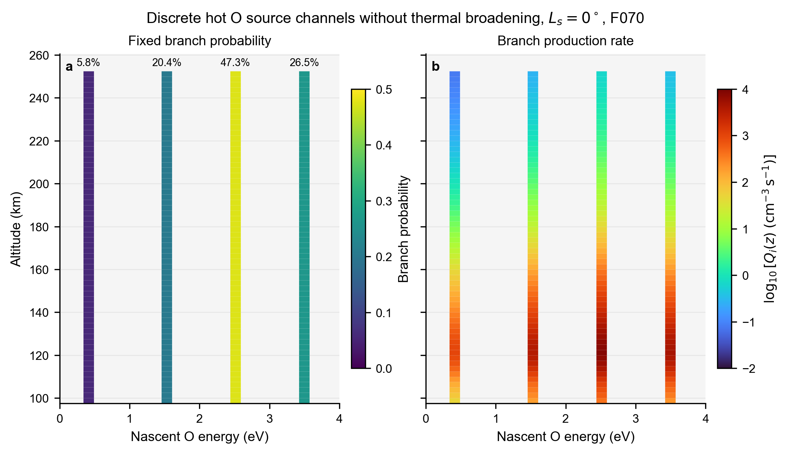
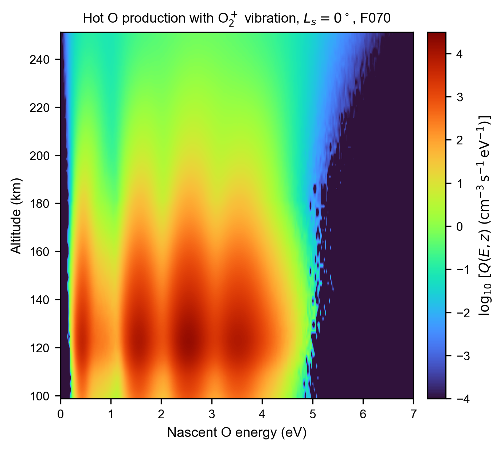

# MarsHotO.jl

Mars Hot Oxygen Transport model, abbreviated MHOT, is a developing model for the production, transport, corona formation, and photochemical escape of hot atomic oxygen at Mars.

The current repository contains the Python prototype used to:

1. Read vertical profiles from Mars Global Ionosphere Thermosphere Model, MGITM, output.
2. Calculate hot O production from O2+ dissociative recombination.
3. Sample the four non-negligible reaction branches.
4. Calculate nascent hot O energy distributions using electron and ion thermal velocities.
5. Include the Martian O2+ vibrational distribution from Fox and Hać (1997).
6. Plot MGITM profiles, discrete reaction channels, nascent energy probabilities, and spectral production rates.

The particle transport core will be developed in Julia. Python will remain responsible for input inspection, validation, analysis, and scientific plotting.

## Current physics

The total hot O production rate is

\[
Q_{\mathrm{hot\,O}}
=2n_en_{\mathrm{O_2^+}}k(T_e).
\]

The four reaction channels use the following total released energies and branching ratios:

| Products | Released energy | Branching ratio |
|---|---:|---:|
| O(3P) + O(3P) | 6.99 eV | 26.5% |
| O(1D) + O(3P) | 5.02 eV | 47.3% |
| O(1D) + O(1D) | 3.06 eV | 20.4% |
| O(1D) + O(1S) | 0.83 eV | 5.8% |

The prototype also supports the Mars exobase O2+ vibrational distribution reported by Fox and Hać (1997). Each vibrational quantum adds approximately 0.23 eV to the total reaction exothermicity.

See [HOT_OXYGEN_MODEL_PLAN.md](HOT_OXYGEN_MODEL_PLAN.md) and [AGENTS.md](AGENTS.md) for the detailed model plan and fixed physical conventions.

## Scripts

### `plot_mgitm_hot_o_profiles.py`

Plots:

1. O2+ density versus altitude
2. Neutral, ion, and electron temperatures versus altitude
3. Total hot O production rate versus altitude

### `plot_discrete_hot_o_energy_lines.py`

Plots the four discrete hot O source energies without thermal broadening. The left panel shows fixed branching probabilities. The right panel shows the altitude-dependent production rate of each branch.

### `reproduce_hot_o_nascent_energy_map.py`

Calculates and plots:

1. The conditional nascent energy probability density
2. The altitude and energy dependent spectral production rate

The calculation currently includes:

1. Maxwellian electron velocities from \(T_e\)
2. Maxwellian O2+ velocities from \(T_i\)
3. Center-of-mass two-body kinematics
4. Isotropic product directions
5. The Fox and Hać (1997) Mars O2+ vibrational distribution

The default calculation uses \(10^6\) dissociative recombination events at each MGITM altitude. Events are processed in batches of \(10^5\) to limit memory use. Heatmaps use bilinear display interpolation, similar to MATLAB `shading interp`. The interpolation affects only figure rendering and does not modify the saved source-data grid.

It does not yet include the velocity-dependent dissociative recombination acceptance probability or O2+ rotational energy.

## Input data

The scripts currently use:

```text
MGITM/MGITM_LS000_F070_150901.dat
```

The `MGITM` directory contains all 12 model cases spanning four seasons and three solar activity levels. The current prototype uses the `Ls = 0 degrees`, F070 case as its baseline.

The baseline case uses the two nearest subsolar grid columns:

```text
Longitude: 27.5 degrees
Latitude: -2.5 and 2.5 degrees
Solar zenith angle: 2.73 degrees
```

The two profiles are averaged.

## Python environment

Install NumPy, pandas, and Matplotlib:

```bash
python -m pip install numpy pandas matplotlib
```

Run the scripts:

```bash
python plot_mgitm_hot_o_profiles.py
python plot_discrete_hot_o_energy_lines.py
python reproduce_hot_o_nascent_energy_map.py
```

Generated figures and source-data tables are written to `figures`.

## Current results

### MGITM profiles and total production


### Discrete reaction channels



### Nascent hot O spectral production with O2+ vibration



## References

1. Fox, J. L., and Hać, A. (1997), Spectrum of hot O at the exobases of the terrestrial planets, Journal of Geophysical Research, 102(A11), 24005-24011, https://doi.org/10.1029/97JA02089.
2. Lillis, R. J., et al. (2017), Photochemical escape of oxygen from Mars: First results from MAVEN in situ data, Journal of Geophysical Research: Space Physics, 122, 3815-3836, https://doi.org/10.1002/2016JA023525.
3. Rahmati, A. (2016), Oxygen Exosphere of Mars: Evidence from Pickup Ions Measured by MAVEN, PhD dissertation, University of Kansas.
