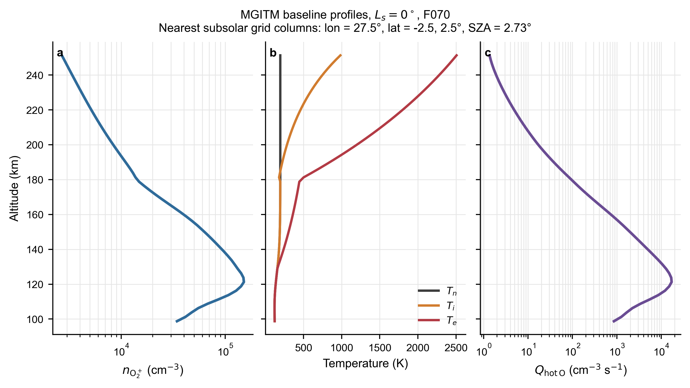
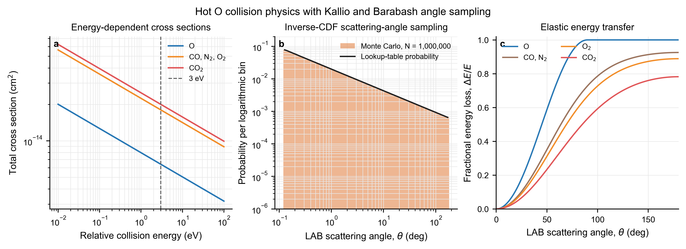
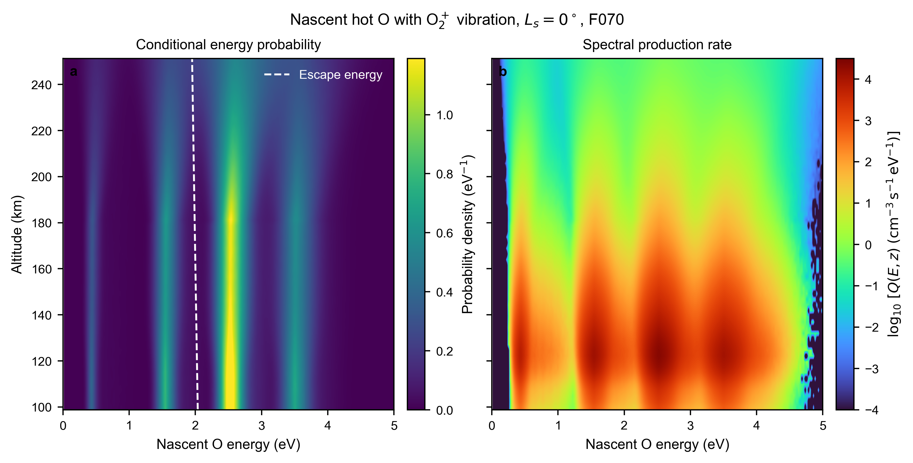
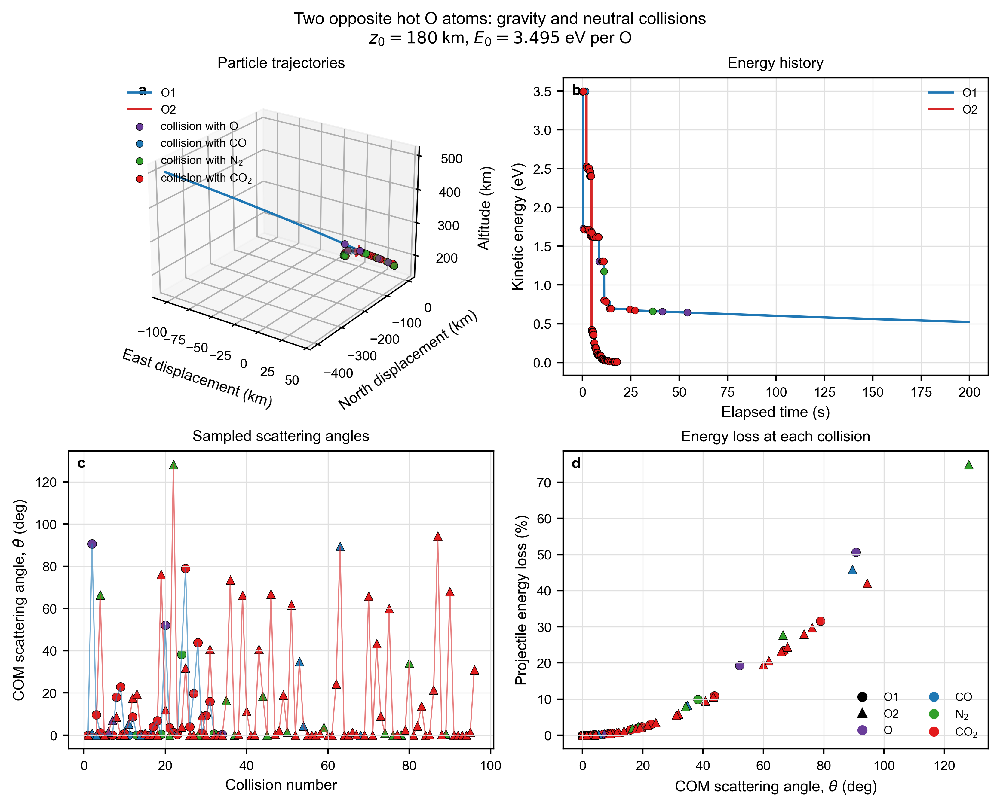
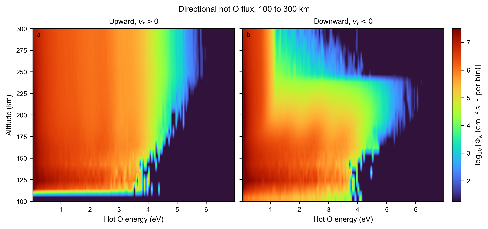
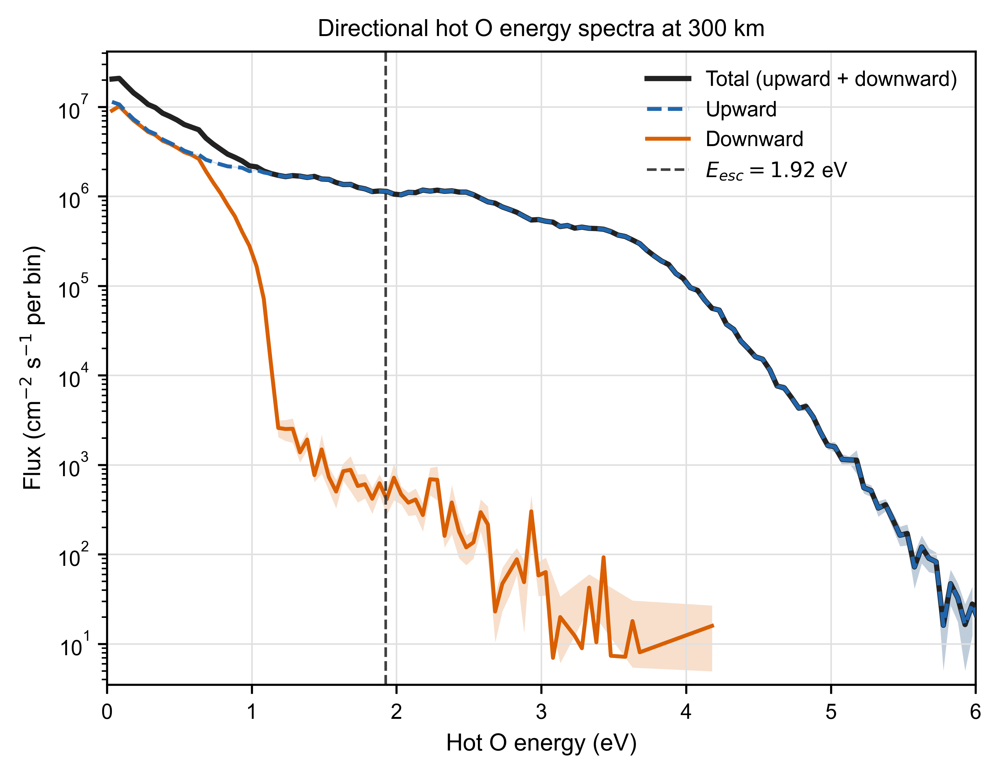

# MarsHotO.jl

Mars Hot Oxygen Transport model, abbreviated MHOT, is a Julia particle-transport package for the production, collisional transport, corona formation, and photochemical escape of hot atomic oxygen at Mars. It supports both direct single-particle propagation and weighted Monte Carlo ensembles.

The current repository contains the Python prototype used to:

1. Read vertical profiles from Mars Global Ionosphere Thermosphere Model, MGITM, output.
2. Calculate hot O production from O2+ dissociative recombination.
3. Sample the four non-negligible reaction branches.
4. Calculate nascent hot O energy distributions using electron and ion thermal velocities.
5. Include the Martian O2+ vibrational distribution from Fox and Hać (1997).
6. Plot MGITM profiles, discrete reaction channels, nascent energy probabilities, and production rates in fixed energy bins.

The Julia core reads MGITM atmospheres, samples O2+ dissociative recombination source particles, samples the Rahmati and Kharchenko analytical COM scattering-angle distribution, performs conservative two-body collision kinematics, and transports particles under collisions and Martian gravity. Python remains responsible for input inspection, validation, analysis, and scientific plotting.

## Package layout

```text
src/                  Julia atmosphere, source, collision, and transport code
data/chemistry/       O2+ dissociative recombination settings
data/cross_sections/  Hot O collision settings
data/atmosphere/      Atmosphere data notes
MGITM/                Packaged MGITM model output
examples/             Python scientific plotting examples
test/                 Julia numerical and physics tests
```

## Collision physics

MarsHotO uses the Rahmati fit to the Kharchenko O and O differential cross section,

```math
\frac{d\sigma}{d\Omega}=\alpha\sin^\beta(\theta_{\mathrm{COM}}/2),
\qquad \beta=-1.85.
```

The probability density includes the solid-angle Jacobian
`2 pi sin(theta_COM)`. The complete interval from 0 to 180 degrees is sampled, with no 10 degree cutoff. The COM angle is generated analytically by inverse transform sampling, the relative velocity is rotated in COM, and the projectile and target velocities are then transformed back to the stationary Mars LAB frame. Post-collision momentum and total kinetic energy are conserved.

物理模型的中文逐步说明见：

* [MarsHotO Monte Carlo 物理模型总览](docs/monte_carlo/HOT_O_COLLISION_MODEL_ZH.md)
* [热 O 与中性大气的碰撞截面](docs/monte_carlo/HOT_O_CROSS_SECTIONS_ZH.md)
* [热 O 高度和初生能量分布](docs/monte_carlo/HOT_O_SOURCE_MODEL_ZH.md)
* [LAB、COM、散射角和碰撞能量损失](docs/monte_carlo/HOT_O_SCATTERING_TWO_BODY_ZH.md)
* [完整 Monte Carlo、方向通量和逃逸率](docs/monte_carlo/HOT_O_CROSSING_FLUX_AND_ESCAPE_ZH.md)

English physics and calculation documentation:

* [MarsHotO Monte Carlo physics model overview](docs/monte_carlo/HOT_O_COLLISION_MODEL_EN.md)
* [Hot O collision cross sections with the neutral atmosphere](docs/monte_carlo/HOT_O_CROSS_SECTIONS_EN.md)
* [Hot O altitude and nascent energy distributions](docs/monte_carlo/HOT_O_SOURCE_MODEL_EN.md)
* [COM scattering angle and two body collision kinematics](docs/monte_carlo/HOT_O_SCATTERING_TWO_BODY_EN.md)
* [Complete Monte Carlo transport, directional flux, and escape rate](docs/monte_carlo/HOT_O_CROSSING_FLUX_AND_ESCAPE_EN.md)

## Current physics

The Julia package provides `transport_particle!` for direct single-particle propagation and `run_hot_o_corona` for weighted three-dimensional Monte Carlo ensembles.

The total hot O production rate is

```math
Q_{\mathrm{hot\,O}}
=2n_en_{\mathrm{O_2^+}}k(T_e).
```

The four reaction channels use the following total released energies and branching ratios:

| Products | Released energy | Branching ratio |
|---|---:|---:|
| O(3P) + O(3P) | 6.99 eV | 26.5% |
| O(1D) + O(3P) | 5.02 eV | 47.3% |
| O(1D) + O(1D) | 3.06 eV | 20.4% |
| O(1D) + O(1S) | 0.83 eV | 5.8% |

The prototype also supports the Mars exobase O2+ vibrational distribution reported by Fox and Hać (1997). Each vibrational quantum adds approximately 0.23 eV to the total reaction exothermicity.

The complete public workflow and fixed physical conventions are documented under `docs/monte_carlo/`.

## Examples and scripts

### `examples/plot_collision_physics.py`

Plots the Rahmati and Kharchenko analytical inverse CDF, fractional energy loss versus COM scattering angle, and total collision cross sections versus energy.

### `examples/plot_mgitm_profiles.py`

Plots O2+ density, neutral/ion/electron temperatures, and hot O production rate versus altitude.

### `examples/shared/plot_thermal_energy_sampling.py`

Plots normalized 300 K Maxwellian velocity-component and kinetic-energy
probability densities together with the isotropic direction-cosine distribution.

### Two opposite hot O trajectory example

Launch two O atoms from 180 km with exactly opposite initial velocities and
3.495 eV per atom, record every collision, and plot their trajectories,
energies, COM scattering angles, and collision partners:

```bash
julia --project=. examples/run_two_opposite_hot_o.jl
python examples/plot_two_opposite_hot_o.py
```

The detailed trajectory and collision tables are written locally under
`examples/output/` and are not committed.

### Particle-level altitude-crossing events

Run the Julia model with a 100 to 2000 km computational domain and write a
fixed-width binary event stream:

```bash
julia --project=. examples/run_hot_o_crossing_events.jl 500 20260810 \
  examples/output/run_1p51m_crossings/batch_01.bin
```

Each event records the particle ID, parent particle ID, macroparticle rate
weight, event time, altitude, three-dimensional velocity, radial velocity,
collision count, altitude-surface index, event type, and radial direction.
Events include particle birth, crossings of 10 km altitude surfaces, and
terminal states. Particles are out of domain when their altitude is below
100 km or above 2000 km.

Calculate upward and downward radial flux directly from the crossing events:

```bash
python examples/plot_directional_hot_o_flux.py \
  examples/output/run_1p51m_crossings
```

For crossing surface radius \(r\), energy bin \(k\), and either radial
direction, the flux is

```math
\Phi_k(r)=\frac{\sum_p w_p}{4\pi r^2}.
```

The output unit is cm\(^{-2}\) s\(^{-1}\) per energy bin. It is not obtained
by multiplying a residence-time density by the total particle speed. Large
binary event files and derived numerical grids remain local under
`examples/output/` and are not committed.

Reproduce the 1.51 million primary-particle calculation as 20 statistically
independent batches:

```bash
julia --project=. examples/run_hot_o_crossing_ensemble.jl \
  20 500 20260810 examples/output/run_1p51m_crossings
```

Each batch represents the same physical source with an independent random
seed. Directional fluxes are calculated for every batch and then averaged.
The complete calculation, including macroparticle weights, collision
transport, crossing-event flux, and the 300 km escape-rate estimate, is
documented in
[HOT_O_CROSSING_FLUX_AND_ESCAPE_ZH.md](docs/monte_carlo/HOT_O_CROSSING_FLUX_AND_ESCAPE_ZH.md).

### Complete Rahmati Monte Carlo example

Run the Julia transport model and then plot the residence-time altitude-energy
density:

```bash
julia --project=. examples/run_hot_o_corona.jl 10000
python examples/plot_hot_o_corona.py
```

The first argument is the number of source particles launched at every source
altitude. The default source grid is 100 to 250 km with 1 km spacing, so
`10000` creates 1.51 million primary particles. At source altitude $z_i$, each
particle carries the production-rate weight

```math
w_i=\frac{Q_{\mathrm{hotO}}(z_i)V_i}{N_i}
\quad \mathrm{s^{-1}},
```

where $V_i$ is the spherical-shell volume and $N_i$ is the number of source
particles at that altitude. Residence time is accumulated as
$w_i\Delta t$ and divided by the diagnostic shell volume. The output is hot O
density in m$^{-3}$ per energy bin, without division by the energy-bin width.
Secondary O atoms inherit the parent particle weight.

The packaged MGITM profile ends near 250 km. Neutral densities above the model
top use a decreasing log-linear extrapolation during transport. The nearest
subsolar column is extended spherically, so its absolute global source rate is
a model approximation rather than a full three-dimensional MGITM result.

### `plot_mgitm_hot_o_profiles.py`

Plots:

1. O2+ density versus altitude
2. Neutral, ion, and electron temperatures versus altitude
3. Total hot O production rate versus altitude

### `plot_discrete_hot_o_energy_lines.py`

Plots the four discrete hot O source energies without thermal broadening. The left panel shows fixed branching probabilities. The right panel shows the altitude-dependent production rate of each branch.

### `reproduce_hot_o_nascent_energy_map.py`

Calculates and plots:

1. The dimensionless conditional probability in each 0.025 eV energy bin,
   $P_k(z)=N_k(z)/N_{\mathrm{tot}}(z)$
2. The production rate in each 0.025 eV energy bin,
   $Q_k(z)=Q_{\mathrm{hotO}}^{(\mathrm{m^{-3}})}(z)P_k(z)$, in
   m$^{-3}$ s$^{-1}$

Neither panel divides by the energy-bin width. Consequently,
$\sum_k P_k(z)=1$ and
$\sum_k Q_k(z)=Q_{\mathrm{hotO}}^{(\mathrm{m^{-3}})}(z)$.
The plotted total production rate is converted from cm$^{-3}$ s$^{-1}$ to
m$^{-3}$ s$^{-1}$ by multiplying by $10^6$.

The calculation currently includes:

1. Zero-bulk three-dimensional Maxwellian electron velocities at $T_e$
2. Zero-bulk three-dimensional Maxwellian O2+ velocities at $T_i$
3. Center-of-mass two-body kinematics
4. Isotropic product directions
5. The Fox and Hać (1997) Mars O2+ vibrational distribution

The default calculation uses $10^6$ dissociative recombination events at each MGITM altitude. Events are processed in batches of $10^5$ to limit memory use. Heatmaps use bilinear display interpolation, similar to MATLAB `shading interp`. The interpolation affects only figure rendering and does not modify the saved source-data grid.

It does not yet include the velocity-dependent dissociative recombination acceptance probability or O2+ rotational energy.

## Input data

The scripts currently use:

```text
MGITM/MGITM_LS000_F070_150901.dat
```

The `MGITM` directory contains all 12 model cases spanning four seasons and three solar activity levels. The current prototype uses the `Ls = 0 degrees`, F070 case as its baseline.

The baseline case uses the two nearest subsolar grid columns:

```text
Longitude: 27.5 degrees
Latitude: -2.5 and 2.5 degrees
Solar zenith angle: 2.73 degrees
```

The two profiles are averaged.

## Python environment

Install NumPy, pandas, and Matplotlib:

```bash
python -m pip install numpy pandas matplotlib
```

Run the scripts:

```bash
python plot_mgitm_hot_o_profiles.py
python examples/plot_mgitm_profiles.py
python examples/plot_collision_physics.py
python plot_discrete_hot_o_energy_lines.py
python reproduce_hot_o_nascent_energy_map.py
```

Generated figures and source-data tables are written to `figures`.

Run the Julia physics tests with:

```bash
julia --project=. -e "using Pkg; Pkg.test()"
```

## Current results

### MGITM profiles and total production



### Hot O collision physics



### Nascent hot O probability and production rate per energy bin



### Two opposite hot O collision trajectories



### Directional hot O flux from 100 to 300 km



### Directional hot O energy spectra at 300 km



For upward particles above the local escape energy of 1.92484 eV, the
projected-area estimate is

```math
\dot N_{\mathrm{esc,proj}}
=\Phi_{\mathrm{esc}}\pi(R_M+300\ \mathrm{km})^2
=(1.23163\pm0.00624)\times10^{25}\ \mathrm{s^{-1}}.
```

The small machine-readable result summary is stored in
[`examples/results/hot_o_escape_flux_300km.json`](examples/results/hot_o_escape_flux_300km.json).

## References

1. Fox, J. L., and Hać, A. (1997), Spectrum of hot O at the exobases of the terrestrial planets, Journal of Geophysical Research, 102(A11), 24005-24011, https://doi.org/10.1029/97JA02089.
2. Lillis, R. J., et al. (2017), Photochemical escape of oxygen from Mars: First results from MAVEN in situ data, Journal of Geophysical Research: Space Physics, 122, 3815-3836, https://doi.org/10.1002/2016JA023525.
3. Rahmati, A. (2016), Oxygen Exosphere of Mars: Evidence from Pickup Ions Measured by MAVEN, PhD dissertation, University of Kansas.
4. Kallio, E., and Barabash, S. (2001), Atmospheric effects of precipitating energetic hydrogen atoms on the Martian atmosphere, Journal of Geophysical Research: Space Physics, 106(A1), 165 to 177, https://doi.org/10.1029/2000JA002003.
