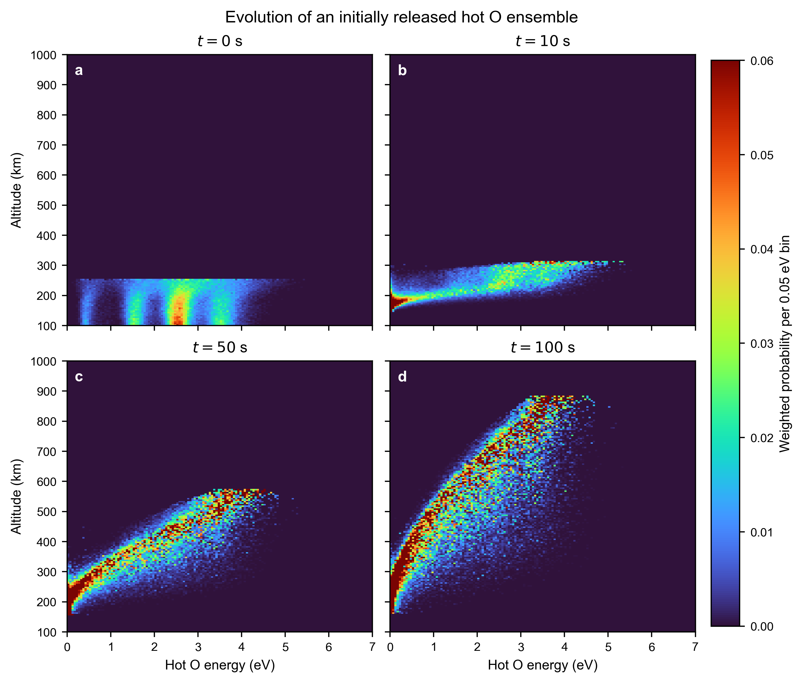

# 热 O Monte Carlo 输运、方向通量与逃逸率

## 1. 本文说明什么

本文给出 MarsHotO 从 MGITM 大气输入到热 O 逃逸率估计的完整计算流程。内容包括：

1. 光化学产生率和宏粒子权重
2. 初生热 O 的位置、能量和方向抽样
3. 火星重力下的逐步推进
4. 中性碰撞、散射角和两体运动学
5. 次级热 O 的产生和追踪
6. 高度面穿越事件的记录
7. 上行和下行通量的计算
8. 300 km 高度逃逸率的计算

Julia 负责源粒子生成和粒子输运。Python 负责读取二进制穿越事件、计算方向通量、估计统计误差和绘图。

## 2. 本次模拟设置

本次结果采用下列设置：

| 参数 | 数值 |
|---|---:|
| MGITM 文件 | `MGITM/MGITM_LS000_F070_150901.dat` |
| 大气剖面 | 最近日下点网格柱 |
| 源区高度 | 100 至 250 km |
| 源区高度间隔 | 1 km |
| 每个批次、每个源高度的初级粒子数 | 500 |
| 独立批次数 | 20 |
| 初级粒子总数 | 1,510,000 |
| 次级 O 总数 | 1,496,727 |
| 实际追踪粒子总数 | 3,006,727 |
| 穿越和终止事件总数 | 98,810,553 |
| 计算区域 | 100 至 2000 km |
| 记录高度面间隔 | 10 km |
| 能量范围 | 0.01 至 7.0 eV |
| 能量格数 | 140 |
| 随机数种子 | 20260810 至 20260829 |

最近日下点的一维剖面被扩展为球对称大气。因此，本次模拟适合检查物理过程和估算通量，但绝对的全球产生率仍依赖球对称近似。

## 3. 从 MGITM 计算热 O 产生率

### 3.1 解离复合反应系数

O2+ 与电子发生解离复合。反应系数为

```math
k(T_e)=1.95\times10^{-7}
\left(\frac{300}{T_e}\right)^{0.70}
\quad \mathrm{cm^3\,s^{-1}},
\qquad T_e\le 1200\ \mathrm{K},
```

```math
k(T_e)=7.39\times10^{-8}
\left(\frac{1200}{T_e}\right)^{0.56}
\quad \mathrm{cm^3\,s^{-1}},
\qquad T_e>1200\ \mathrm{K}.
```

一次反应产生两个 O 原子，所以体积产生率为

```math
Q_{\mathrm{hot\,O}}(z)
=2n_e(z)n_{\mathrm{O_2^+}}(z)k[T_e(z)].
```

程序内部将密度、长度、截面和反应系数统一转换为 SI 单位，因此

```math
[Q_{\mathrm{hot\,O}}]=\mathrm{m^{-3}\,s^{-1}}.
```

### 3.2 每个宏粒子的权重

源高度为 $z_i$，对应球壳体积为

```math
V_i=\frac{4\pi}{3}
\left[
(R_M+z_{i,+})^3-(R_M+z_{i,-})^3
\right].
```

该球壳中每秒产生的热 O 数量为

```math
\dot N_i=Q_{\mathrm{hot\,O}}(z_i)V_i.
```

若在该高度生成 $N_i$ 个 Monte Carlo 初级宏粒子，则每个宏粒子的权重为

```math
w_i=\frac{\dot N_i}{N_i},
\qquad [w_i]=\mathrm{s^{-1}}.
```

因此，一个模拟粒子不是一个真实 O 原子。它代表每秒产生的 $w_i$ 个真实 O 原子。次级反冲 O 继承母粒子的相同权重。

20 个批次都是对同一个物理源的独立 Monte Carlo 估计。因此，批次结果必须取平均，不能把 20 个批次的通量直接相加。

## 4. 初生热 O 的速度和能量

### 4.1 反应物 Maxwell 分布

在每个源高度，电子速度和 O2+ 速度分别从三维 Maxwell 分布抽取：

```math
f_s(\mathbf v)
=
\left(\frac{m_s}{2\pi k_B T_s}\right)^{3/2}
\exp\left(
-\frac{m_s|\mathbf v-\mathbf u_s|^2}{2k_B T_s}
\right).
```

当前模型令电子和 O2+ 的体速度均为零：

```math
\mathbf u_e=\mathbf u_{\mathrm{O_2^+}}=(0,0,0).
```

三个速度分量彼此独立，每个分量满足

```math
v_j\sim\mathcal N\left(0,\frac{k_BT_s}{m_s}\right).
```

### 4.2 质心速度和相对能量

反应物质心速度为

```math
\mathbf V_{\mathrm{COM}}
=
\frac{
m_e\mathbf v_e+m_i\mathbf v_i
}{
m_e+m_i
}.
```

约化质量和相对平动能为

```math
\mu=\frac{m_em_i}{m_e+m_i},
```

```math
E_{\mathrm{rel}}
=\frac{1}{2}\mu
|\mathbf v_e-\mathbf v_i|^2.
```

### 4.3 反应分支和振动态

四个反应分支及概率为：

| 产物 | 总释放能量 | 概率 |
|---|---:|---:|
| O(3P) + O(3P) | 6.99 eV | 0.265 |
| O(1D) + O(3P) | 5.02 eV | 0.473 |
| O(1D) + O(1D) | 3.06 eV | 0.204 |
| O(1D) + O(1S) | 0.83 eV | 0.058 |

程序还从配置文件抽取 O2+ 振动态 $v$。每个振动量子增加 0.23 eV。可用于两个产物的总能量为

```math
E_{\mathrm{avail}}
=E_{\mathrm{branch}}+E_{\mathrm{rel}}+0.23v.
```

对于两个质量相同的 O 原子，每个产物在质心系中获得一半的可用动能。其相对质心速度大小为

```math
u_O=\sqrt{\frac{E_{\mathrm{avail}}}{m_O}},
```

其中能量在程序中转换为焦耳。产物方向按各向同性抽取，随后加上反应物质心速度：

```math
\mathbf v_{O,\mathrm{LAB}}
=\mathbf V_{\mathrm{COM}}+u_O\hat{\mathbf n}.
```

这里 LAB 是以火星为参考的静止坐标系。

## 5. 热 O 的逐步输运

### 5.1 平均自由程和步长

在粒子当前高度和能量处，总碰撞系数为

```math
\kappa(E,z)=
\sum_s n_s(z)\sigma_s(E),
```

平均自由程为

```math
\lambda(E,z)=\frac{1}{\kappa(E,z)}.
```

当前模型包含 O、CO、N2、O2 和 CO2。总截面采用

```math
\sigma_s(E)
=\sigma_s(3\ \mathrm{eV})
\left(\frac{E}{3\ \mathrm{eV}}\right)^{-0.2}.
```

Rahmati 步长规则为

```math
ds=
\begin{cases}
0.1\lambda, & \lambda<10\ \mathrm{km},\\
1\ \mathrm{km}, & \lambda\ge 10\ \mathrm{km}.
\end{cases}
```

### 5.2 火星重力

重力加速度为

```math
\mathbf a(\mathbf r)
=-\frac{GM_M}{|\mathbf r|^3}\mathbf r.
```

每一步先根据 $dt=ds/|\mathbf v|$ 估计飞行时间，再使用速度 Verlet 形式更新位置和速度。这样，粒子沿三维轨迹运动，并随高度变化获得或损失重力势能。

### 5.3 是否发生碰撞

单步碰撞概率按 Rahmati 流程计算：

```math
P_{\mathrm{collision}}
=\min(ds\,\kappa,1).
```

生成均匀随机数 $R\in[0,1)$。若

```math
R<P_{\mathrm{collision}},
```

则该步发生一次碰撞。

若发生碰撞，与成分 $s$ 碰撞的条件概率为

```math
P_s
=
\frac{n_s\sigma_s}
{\sum_j n_j\sigma_j}.
```

### 5.4 COM 散射角

当前模型使用 Rahmati 对 Kharchenko O 与 O 微分截面的解析拟合：

```math
\frac{d\sigma}{d\Omega}
=\alpha\sin^\beta
\left(\frac{\theta_{\mathrm{COM}}}{2}\right),
\qquad \beta=-1.85.
```

角度概率必须包含立体角 Jacobian。归一化后的极角概率密度与

```math
\frac{d\sigma}{d\Omega}
\sin\theta_{\mathrm{COM}}
```

成正比。程序使用逆累积分布抽取
$\theta_{\mathrm{COM}}$，并在 $0$ 到 $2\pi$ 内均匀抽取方位角。

当前版本将这一 COM 角分布用于所有中性碰撞成分。以后获得成分相关的微分截面后，可以分别替换。

### 5.5 两体弹性碰撞

碰撞前中性靶粒子在火星静止系中固定为零速度。质心速度为

```math
\mathbf V_{\mathrm{COM}}
=
\frac{
m_O\mathbf v_O+m_s\mathbf v_s
}{
m_O+m_s
},
\qquad \mathbf v_s=0.
```

程序在 COM 中旋转相对速度，但保持相对速度大小不变，然后转换回火星静止系：

```math
\mathbf v'_O
=
\mathbf V_{\mathrm{COM}}
+
\frac{m_s}{m_O+m_s}\mathbf g',
```

```math
\mathbf v'_s
=
\mathbf V_{\mathrm{COM}}
-
\frac{m_O}{m_O+m_s}\mathbf g'.
```

其中 $\mathbf g'$ 是散射后的相对速度。该计算严格保持总动量和总动能。

入射热 O 的能量损失比例为

```math
\frac{\Delta E}{E}
=
\frac{2m_Om_s}{(m_O+m_s)^2}
\left(1-\cos\theta_{\mathrm{COM}}\right).
```

如果靶粒子是 O，并且反冲 O 的能量高于 0.01 eV，则把该反冲 O 加入追踪队列。它成为次级热 O。

## 6. 终止条件和原始事件

粒子满足任一条件时停止：

1. 动能小于或等于 0.01 eV
2. 高度低于 100 km
3. 高度高于 2000 km
4. 超过最大步数
5. 粒子队列超过安全上限

本次方向通量计算不保存每一个数值积分步。它只保存具有物理诊断意义的事件：

1. 粒子生成
2. 穿过指定高度面
3. 离开下边界
4. 离开上边界
5. 热化
6. 达到数值安全限制

每条事件记录包括粒子编号、母粒子编号、权重、时间、高度、三维速度、径向速度、碰撞次数、事件类型和运动方向。

## 7. 从穿越事件计算方向通量

在半径

```math
r=R_M+z
```

的球面上，把穿越事件按能量格和径向速度方向分类：

```math
v_r>0
\quad\text{为上行},
```

```math
v_r<0
\quad\text{为下行}.
```

第 $k$ 个能量格的方向通量为

```math
\Phi_k(r)
=
\frac{
\sum_{p\in k}w_p
}{
4\pi r^2
}.
```

单位为

```math
\mathrm{cm^{-2}\,s^{-1}\ per\ energy\ bin}.
```

这里没有除以能量格宽度。因此，它表示每个能量格中的通量，而不是单位 eV 的谱密度。

对 20 个独立批次分别计算 $\Phi_k$，最终曲线取批次平均。图中的阴影表示 20 个批次均值的标准误差。相对误差过大的能量格不画阴影。

### 7.1 固定飞行时间的高度能量快照

除了稳态高度面穿越事件，MarsHotO 还提供固定飞行时间快照，用于检查一组初始热 O 如何随时间传播。该诊断在 $t=0$ 同时释放所有初级热 O，并在

```math
t=0,\ 10,\ 50,\ 100\ \mathrm{s}
```

记录仍在计算区域内的粒子。碰撞产生的次级 O 也包括在内。次级 O 的起始时间是实际碰撞发生时间，而不是重新设为零。

本次快照计算在 100 至 250 km 每隔 1 km 生成 1000 个初级粒子，共有

```math
151\times1000=151{,}000
```

个初级热 O。绘图使用 5 km 高度格和 0.05 eV 能量格，显示范围为 100 至 1000 km 和 0 至 7 eV。

对于时刻 $t$、高度格 $i$ 和能量格 $k$，先累加位于该格中的宏粒子权重：

```math
\dot N_{ik}(t)
=
\sum_{p\in(i,k,t)}w_p,
\qquad
[\dot N_{ik}]=\mathrm{s^{-1}}.
```

然后除以高度格中心对应的球面积：

```math
\Phi_{ik}^{\mathrm{snap}}(t)
=
\frac{
\dot N_{ik}(t)
}{
4\pi(R_M+z_i)^2
}.
```

单位为

```math
\mathrm{cm^{-2}\,s^{-1}\ per\ energy\ bin}.
```

该结果不除以能量格宽度。图中颜色为

```math
\log_{10}\Phi_{ik}^{\mathrm{snap}}.
```



图 a 至 d 分别对应 0、10、50 和 100 s。初始粒子位于 100 至 250 km。随飞行时间增加，高能粒子传播到更高位置，并形成明显的高度和能量相关性。为避免低样本噪声，粒子数少于 20 的高度格显示为 colorbar 的最低颜色。

这里的 $\Phi_{ik}^{\mathrm{snap}}$ 是固定时刻位于高度格内的宏粒子产生率除以球面积，因此称为快照通量估计。它没有按照径向速度分为上行和下行，也不等同于穿过球面的净径向通量。逃逸率仍必须使用第 7 节定义的高度面穿越事件通量。

从项目根目录运行：

```bash
julia --project=. examples/run_hot_o_time_snapshots.jl \
  1000 20260730 examples/output/hot_o_time_snapshots.dat
```

然后绘图：

```bash
C:\Users\Win\.conda\envs\mars\python.exe \
  examples/plot_hot_o_time_snapshots.py
```

大型本地快照数据保存在 `examples/output/`，不提交到 GitHub。GitHub 只保存模拟代码、绘图代码和最终 PNG。

## 8. 100 至 300 km 的方向通量


左图为上行通量，右图为下行通量。低高度区域碰撞频繁，因此上行和下行粒子都较多。随高度增加，下行高能粒子快速减少，而上行粒子仍保留明显的高能尾部。

## 9. 300 km 能谱


对所有能量格求和后，300 km 处的上行通量为

```math
\Phi_{\mathrm{up}}
=
(1.49449\pm0.00506)\times10^8
\ \mathrm{cm^{-2}\,s^{-1}}.
```

下行通量为

```math
\Phi_{\mathrm{down}}
=
(7.91631\pm0.03441)\times10^7
\ \mathrm{cm^{-2}\,s^{-1}}.
```

## 10. 300 km 局地逃逸能量

一个 O 原子在半径 $r$ 处的局地逃逸能量为

```math
E_{\mathrm{esc}}(r)
=
\frac{GM_Mm_O}{r}.
```

取

```math
R_M=3389.5\ \mathrm{km},
\qquad z=300\ \mathrm{km},
```

得到

```math
r=R_M+z=3689.5\ \mathrm{km},
```

```math
E_{\mathrm{esc}}(300\ \mathrm{km})
=1.92484\ \mathrm{eV}.
```

只对能量格中心满足

```math
E_k\ge E_{\mathrm{esc}}
```

的上行粒子求和，得到具有局地逃逸能量的上行通量：

```math
\Phi_{\mathrm{esc}}
=
(2.88003\pm0.01458)\times10^7
\ \mathrm{cm^{-2}\,s^{-1}}.
```

## 11. 按投影面积计算逃逸率

按照本项目当前采用的投影面积定义：

```math
A_{\mathrm{proj}}
=
\pi(R_M+300\ \mathrm{km})^2.
```

将半径转换为厘米：

```math
r=3.6895\times10^8\ \mathrm{cm}.
```

所以

```math
A_{\mathrm{proj}}
=\pi r^2
=4.27646\times10^{17}\ \mathrm{cm^2}.
```

如果把所有上行粒子都包括在内：

```math
\dot N_{\mathrm{up,proj}}
=\Phi_{\mathrm{up}}A_{\mathrm{proj}}
=6.39114\times10^{25}\ \mathrm{s^{-1}}.
```

但是，低于局地逃逸能量的上行粒子仍会被火星重力束缚，不能直接计入逃逸。因此，投影面积逃逸率估计为

```math
\dot N_{\mathrm{esc,proj}}
=
\Phi_{\mathrm{esc}}A_{\mathrm{proj}},
```

```math
\boxed{
\dot N_{\mathrm{esc,proj}}
=
(1.23163\pm0.00624)\times10^{25}
\ \mathrm{s^{-1}}
}.
```

## 12. 球对称面积对照

本次通量定义本身使用球面积 $4\pi r^2$。如果将最近日下点剖面解释为全球球对称大气，则与该几何假设一致的全球逃逸率为

```math
\dot N_{\mathrm{esc,global}}
=
\Phi_{\mathrm{esc}}4\pi r^2,
```

```math
\dot N_{\mathrm{esc,global}}
=
(4.92653\pm0.02494)\times10^{25}
\ \mathrm{s^{-1}}.
```

该数值是球对称外推结果，不是由三维 MGITM 全球大气直接积分得到的全球逃逸率。

另外，$E\ge E_{\mathrm{esc}}$ 只表示粒子在 300 km 处具有足够的局地机械能。如果 300 km 以上仍发生碰撞，其最终状态可能改变。因此，该结果应称为 300 km 高度的能量判据逃逸率估计。

## 13. 如何复现

### 13.1 运行 20 个独立批次

在项目根目录执行：

```bash
julia --project=. examples/run_hot_o_crossing_ensemble.jl \
  20 500 20260810 examples/output/run_1p51m_crossings
```

参数依次为：

1. 批次数
2. 每个源高度、每个批次的初级粒子数
3. 第一个随机数种子
4. 本地输出目录

该设置包含 151 个源高度，因此初级粒子总数为

```math
20\times500\times151=1{,}510{,}000.
```

### 13.2 计算通量并绘图

```bash
C:\Users\Win\.conda\envs\mars\python.exe \
  examples/plot_directional_hot_o_flux.py \
  examples/output/run_1p51m_crossings
```

原始二进制事件文件约为 8.7 GB，只保存在本地，不提交到 GitHub。GitHub 保存完整计算代码、固定输入、可复现命令、最终 PNG 和小型数值汇总。

机器可读的 300 km 数值汇总见：

```text
examples/results/hot_o_escape_flux_300km.json
```

## 14. 代码对应关系

| 文件 | 功能 |
|---|---|
| `src/atmosphere.jl` | 读取和插值 MGITM 大气 |
| `src/chemistry.jl` | 解离复合系数和热 O 产生率 |
| `src/source_particles.jl` | Maxwell 速度、反应分支、振动态和初生热 O |
| `src/cross_sections.jl` | 总截面、碰撞系数和靶成分抽取 |
| `src/scattering.jl` | Rahmati COM 散射角 PDF、CDF 和逆变换抽样 |
| `src/collision_kinematics.jl` | COM 两体弹性碰撞和静止系速度 |
| `src/ensembles.jl` | 重力推进、步长规则和驻留时间估计 |
| `src/crossing_events.jl` | 宏粒子队列、次级 O 和高度面穿越事件 |
| `examples/run_hot_o_crossing_ensemble.jl` | 20 批次 Monte Carlo 运行入口 |
| `examples/plot_directional_hot_o_flux.py` | 穿越事件后处理、通量、误差、逃逸率和绘图 |
| `examples/run_hot_o_time_snapshots.jl` | 生成 0、10、50 和 100 s 的固定飞行时间快照 |
| `examples/plot_hot_o_time_snapshots.py` | 计算面积归一化快照通量并绘制两行两列图 |
| `test/runtests.jl` | Maxwell 分布、截面、散射、守恒和可重复性测试 |
