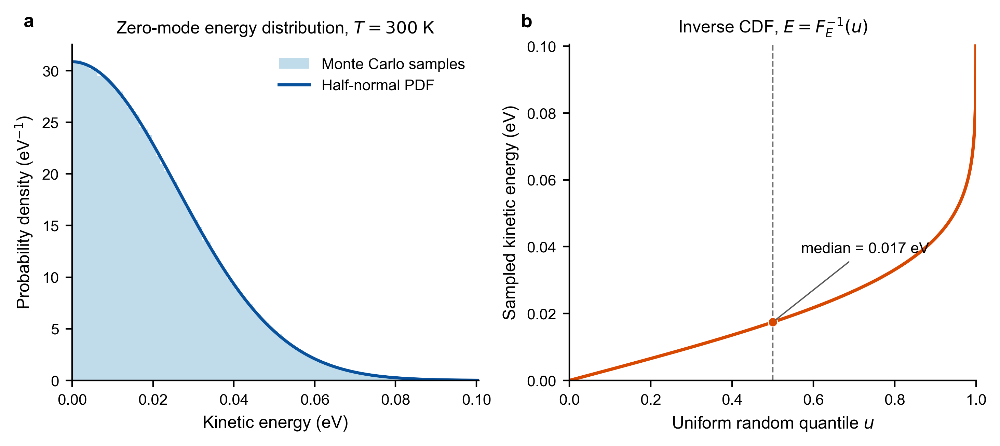

# Hot O Altitude and Nascent Energy Distributions

## 1. Quantities calculated by the source model

The source model calculates three quantities:

1. The total number of hot O atoms produced per unit volume and per unit time at each altitude, $Q_{\mathrm{hotO}}(z)$.
2. The probability that a hot O atom produced at that altitude falls in energy bin $k$, $P_k(z)$.
3. The hot O production rate in energy bin $k$, $Q_k(z)$.

For the energy interval $[E_k,E_k+\Delta E)$, the binned probability is

```math
P_k(z)
=
\frac{N_k(z)}{N_{\mathrm{tot}}(z)}.
```

It is dimensionless and satisfies

```math
\sum_kP_k(z)=1.
```

The left panel of the nascent energy figure shows $P_k(z)$. It is not divided by the energy bin width $\Delta E$.

The right panel uses

```math
Q_k(z)
=
Q_{\mathrm{hotO}}^{(\mathrm{m^{-3}})}(z)P_k(z).
```

It is also not divided by $\Delta E$. Summing the production over all energy bins recovers the total production rate at that altitude:

```math
\sum_kQ_k(z)
=
Q_{\mathrm{hotO}}^{(\mathrm{m^{-3}})}(z).
```

The quantity $Q_k(z)$ describes the source distribution at birth. It is not the hot O corona density after collisional transport.

## 2. Altitude dependent production rate

The main photochemical source is dissociative recombination:

```math
\mathrm{O_2^+}+e
\rightarrow
\mathrm{O}+\mathrm{O}.
```

The reaction event rate is

```math
R_{\mathrm{DR}}(z)
=
n_e(z)n_{\mathrm{O_2^+}}(z)
\alpha[T_e(z)].
```

Each reaction produces two O atoms, so the hot O atom production rate is

```math
Q_{\mathrm{hotO}}(z)
=
2n_e(z)n_{\mathrm{O_2^+}}(z)
\alpha[T_e(z)].
```

The reaction coefficient is

```math
\alpha(T_e)
=
\begin{cases}
1.95\times10^{-7}
\left(\dfrac{300}{T_e}\right)^{0.70},
& T_e\le1200\ \mathrm{K},\\[6pt]
7.39\times10^{-8}
\left(\dfrac{1200}{T_e}\right)^{0.56},
& T_e>1200\ \mathrm{K},
\end{cases}
```

with units of $\mathrm{cm^3\,s^{-1}}$.

The altitude profile of the production rate is controlled primarily by $n_e$ and $n_{\mathrm{O_2^+}}$. The electron temperature provides an additional modulation through the reaction coefficient.

The following figure shows the O2+ number density, temperatures, and total volumetric hot O production rate for the default MGITM atmosphere. Panel c is $Q_{\mathrm{hotO}}(z)$ in $\mathrm{cm^{-3}\,s^{-1}}$.


## 3. Four reaction branches

The model includes four nonnegligible dissociative recombination branches.

| Products | Total released energy | Branch probability | Basic energy of one O for equal sharing |
|---|---:|---:|---:|
| O($^3P$) + O($^3P$) | 6.99 eV | 26.5% | 3.495 eV |
| O($^1D$) + O($^3P$) | 5.02 eV | 47.3% | 2.510 eV |
| O($^1D$) + O($^1D$) | 3.06 eV | 20.4% | 1.530 eV |
| O($^1D$) + O($^1S$) | 0.83 eV | 5.8% | 0.415 eV |

If the electron and O2+ ion were both stationary and no vibrational energy were included, each branch would appear as a narrow vertical line in an altitude and energy plot.

The physical distribution is broader because both reactants have thermal velocities before recombination and the O2+ ion can occupy different vibrational states.

## 4. Role of Monte Carlo sampling

Many dissociative recombination events are generated independently at every MGITM altitude $z$. Each event follows these steps:

1. Select one reaction channel using the branching probabilities.
2. Sample an electron velocity using $T_e(z)$.
3. Sample an O2+ velocity using $T_i(z)$.
4. Sample a vibrational quantum number $v$ from the vibrational population.
5. Calculate the relative velocity of the two O products in the reactant center of mass frame.
6. Sample an isotropic product direction.
7. Transform the two product velocities to the Mars stationary frame.
8. Record the kinetic energy of each O atom in the Mars stationary frame.

After enough events are generated, the kinetic energies are placed into a histogram. Dividing the count in each energy bin by the total count gives $P_k(z)$. Multiplying $P_k(z)$ by the total production rate gives $Q_k(z)$.

Monte Carlo sampling is not used to calculate the total production rate. The total production rate follows directly from the densities and reaction coefficient. Monte Carlo sampling converts the reaction branches, reactant thermal velocities, vibrational states, and product directions into a nascent energy probability distribution in the Mars stationary frame.

## 5. Sampling velocities from $T_e$ and $T_i$

The current model sets the bulk velocities of the electrons and O2+ ions to zero:

```math
\mathbf u_{e,\mathrm{bulk}}
=
\mathbf u_{i,\mathrm{bulk}}
=0.
```

Temperature controls only the thermal motion around zero bulk velocity. Both species use a normalized three dimensional Maxwellian velocity distribution:

```math
f_s(\mathbf v\mid T_s)
=
\left(
\frac{m_s}{2\pi k_{\mathrm B}T_s}
\right)^{3/2}
\exp
\left[
-\frac{
m_s|\mathbf v-\mathbf u_s|^2
}{
2k_{\mathrm B}T_s
}
\right].
```

For the present calculation,

```math
\mathbf u_s=(0,0,0).
```

The probability density integrates to one over the complete three dimensional velocity space:

```math
\int_{\mathbb R^3}
f_s(\mathbf v\mid T_s)\,d^3v
=1.
```

The physical velocity distribution $n_sf_s$ integrates to $n_s$. Source particle sampling requires only the normalized probability distribution, so the density does not multiply the random velocity distribution. Density is already included in $Q_{\mathrm{hotO}}(z)$ and in the macroparticle weight.

MarsHotO uses the same thermal speed convention as TestParticle.jl:

```math
v_{\mathrm{th},s}
=
\sqrt{
\frac{2k_{\mathrm B}T_s}{m_s}
}.
```

This corresponds to the TestParticle.jl construction

```julia
u_bulk = [0.0, 0.0, 0.0]
p = n * kB * T
vdf = TP.Maxwellian(u_bulk, p, n; m=mass)
```

MarsHotO does not require TestParticle.jl. Its `sample_maxwellian_velocity` function performs sampling directly from the same mathematical definition.

The standard deviation of each Cartesian velocity component is

```math
\sigma_{v,s}
=
\frac{v_{\mathrm{th},s}}{\sqrt{2}}
=
\sqrt{
\frac{k_{\mathrm B}T_s}{m_s}
}.
```

For each reactant, three independent standard normal random variables are sampled:

```math
\xi_x,\xi_y,\xi_z
\sim
\mathcal N(0,1).
```

The velocity is

```math
\mathbf v_s
=
\mathbf u_s
+
\sqrt{
\frac{k_{\mathrm B}T_s}{m_s}
}
(\xi_x,\xi_y,\xi_z).
```

When $\mathbf u_s=0$, all components have the same variance. The resulting three dimensional distribution is isotropic, and the velocity direction naturally covers the complete sphere. No separate sampling of polar and azimuthal angles is required.

The corresponding speed probability density is

```math
P_s(v)
=
4\pi v^2
\left(
\frac{m_s}{2\pi k_{\mathrm B}T_s}
\right)^{3/2}
\exp
\left(
-\frac{m_sv^2}{2k_{\mathrm B}T_s}
\right),
\qquad v\ge0.
```

The total kinetic energy probability density is

```math
p_s(E\mid T_s)
=
\frac{2}{\sqrt{\pi}}
\frac{\sqrt{E}}
{(k_{\mathrm B}T_s)^{3/2}}
\exp
\left(
-\frac{E}{k_{\mathrm B}T_s}
\right),
\qquad E\ge0.
```

It satisfies

```math
\int_0^\infty
p_s(E\mid T_s)\,dE
=1,
\qquad
\langle E_s\rangle
=
\frac{3}{2}k_{\mathrm B}T_s.
```

The following figure verifies the sampled velocity components, total kinetic energy, and direction cosine at 300 K.



The electron mass is much smaller than the O2+ mass, so an electron has a much larger speed than an O2+ ion at the same temperature or kinetic energy. After sampling $\mathbf v_e$ and $\mathbf v_i$, the reactant center of mass velocity is

```math
\mathbf V_{\mathrm{COM}}
=
\frac{
m_e\mathbf v_e+m_i\mathbf v_i
}{
m_e+m_i
}.
```

The relative kinetic energy of the reactants is

```math
E_{\mathrm{rel}}
=
\frac{1}{2}\mu
\left|
\mathbf v_e-\mathbf v_i
\right|^2,
\qquad
\mu
=
\frac{m_em_i}{m_e+m_i}.
```

Because $T_e$ and $T_i$ vary with altitude, the statistical distributions of $\mathbf V_{\mathrm{COM}}$ and $E_{\mathrm{rel}}$ also vary with altitude. This is one reason that the widths of the nascent energy peaks vary with altitude.

## 6. Inclusion of O2+ vibration

The current configuration uses a vibrational quantum spacing

```math
\Delta E_{\mathrm{vib}}
=
0.23\ \mathrm{eV}
```

and the following populations for $v=0$ through $8$:

```text
0.800, 0.074, 0.043, 0.035, 0.025,
0.015, 0.0047, 0.00027, 0.00021
```

The code first normalizes these fractions and then samples $v$. The additional vibrational energy carried by an event is

```math
E_{\mathrm{vib}}
=
v\Delta E_{\mathrm{vib}}.
```

For a reaction branch with released energy $E_b$, the total available translational energy is approximated as

```math
E_{\mathrm{avail}}
=
E_b+E_{\mathrm{rel}}+E_{\mathrm{vib}}.
```

Vibrational energy produces additional structure and broadening on the high energy side of each basic reaction peak.

This is the energy budget approximation used by the current model. A more detailed model could also allow the vibrational state to modify the branching probabilities of the dissociation channels.

## 7. Two O atoms in the product center of mass frame

The two products are O atoms with equal mass. In the product center of mass frame, they have equal speeds and opposite directions. Each O therefore receives half of the total available energy:

```math
E_{\mathrm O,\mathrm{COM}}
=
\frac{E_{\mathrm{avail}}}{2}.
```

The speed of each O atom is

```math
u
=
\sqrt{
\frac{E_{\mathrm{avail}}}{m_{\mathrm O}}
},
```

where $E_{\mathrm{avail}}$ is converted from eV to J during the calculation.

After an isotropic unit vector $\hat{\mathbf n}$ is sampled, the product velocities in the Mars stationary frame are

```math
\mathbf v_{\mathrm O,1}
=
\mathbf V_{\mathrm{COM}}
+u\hat{\mathbf n},
```

```math
\mathbf v_{\mathrm O,2}
=
\mathbf V_{\mathrm{COM}}
-u\hat{\mathbf n}.
```

The kinetic energy in the Mars stationary frame is

```math
E_{\mathrm O,\mathrm{LAB}}
=
\frac{1}{2}m_{\mathrm O}
\left|
\mathbf v_{\mathrm O}
\right|^2.
```

A single COM energy does not correspond to a unique energy in the Mars stationary frame because the angle between $\mathbf V_{\mathrm{COM}}$ and $\hat{\mathbf n}$ changes from event to event. This effect further broadens each energy peak.

## 8. Constructing the altitude and energy maps

Many events are generated independently at every altitude. Let $N_k(z)$ be the number of hot O samples in energy bin $k$, and let $N_{\mathrm{tot}}(z)$ be the total sample count at that altitude. The energy bin width used in the current figure is

```math
\Delta E
=
0.025\ \mathrm{eV}.
```

### 8.1 Left panel, probability in each energy bin

The left panel uses

```math
P_k(z)
=
\frac{N_k(z)}
{N_{\mathrm{tot}}(z)}.
```

It is the probability that one newly produced hot O atom falls in energy bin $k$. It is dimensionless and satisfies

```math
\sum_kP_k(z)=1
```

at every altitude. It is not divided by $\Delta E$. The colorbar is labeled `Probability per 0.025 eV bin`.

### 8.2 Right panel, production rate in each energy bin

The right panel uses

```math
Q_k(z)
=
Q_{\mathrm{hotO}}^{(\mathrm{m^{-3}})}(z)
P_k(z).
```

The total source profile is initially calculated in $\mathrm{cm^{-3}\,s^{-1}}$. Before plotting, it is converted to $\mathrm{m^{-3}\,s^{-1}}$:

```math
Q_{\mathrm{hotO}}^{(\mathrm{m^{-3}})}(z)
=
10^6
Q_{\mathrm{hotO}}^{(\mathrm{cm^{-3}})}(z).
```

Each value in the right panel gives the number of hot O atoms produced per cubic meter and per second in energy bin $k$. Its unit is $\mathrm{m^{-3}\,s^{-1}}$, and it satisfies

```math
\sum_kQ_k(z)
=
Q_{\mathrm{hotO}}^{(\mathrm{m^{-3}})}(z).
```

Neither panel is divided by $\Delta E$.

In the figure:

* The horizontal axis is the nascent O energy in the Mars stationary frame.
* The vertical axis is the production altitude.
* Color in the left panel is the binned probability $P_k(z)$.
* Color in the right panel is $\log_{10}Q_k(z)$, where $Q_k$ has units of $\mathrm{m^{-3}\,s^{-1}}$.
* Display interpolation smooths the appearance of the color cells but adds no physical information.


## 9. Relation to the Rahmati and Lillis models

The source models of Rahmati and Lillis follow the same basic principles:

1. The dissociative recombination rate determines the altitude dependent source strength.
2. The released energy of each branch determines the main energy peaks.
3. Reactant thermal velocities and two body reaction kinematics determine the nascent energy in the Mars stationary frame.
4. Weighted dissociative-recombination events are generated directly at each altitude. Each event produces an O pair, and both atoms are passed separately to the single-particle transport model.

MarsHotO additionally includes the specified O2+ vibrational population explicitly. The quantities $P_k(z)$ and $Q_k(z)$ are diagnostic histograms used for plotting and source validation. They are not used to resample independent single-O energies for transport. Direct event sampling preserves the common branch, vibrational state, COM velocity, and opposite product velocities of each reaction.

## 10. Essential distinctions

```text
Q_hotO(z)      Total hot O production per unit volume and time
P_k(z)         Probability that a nascent hot O falls in energy bin k
Q_k(z)         Production rate in energy bin k, in m^-3 s^-1
O corona       Altitude, energy, and velocity distributions after transport
```

The chemical event sampler provides both the diagnostic $Q_k(z)$ and the paired particles that are transported directly to calculate the hot O corona.

## 11. Macroparticle weights in the transport Monte Carlo model

The default source altitude grid extends from 100 to 250 km with 1 km spacing. Define the reaction-event rate as

```math
R_{\mathrm{DR}}(z_i)=n_e(z_i)n_{\mathrm{O_2^+}}(z_i)k[T_e(z_i)].
```

The nominal large ensemble generates

```math
N_{\mathrm{event},i}=10000
```

reaction events at each altitude. Every event produces two primary hot O atoms, giving

```math
151\times20000
=
3.02\times10^6
```

primary particles.

The spherical shell volume associated with source altitude $i$ is

```math
V_i
=
\frac{4\pi}{3}
\left[
(R_{\mathrm M}+z_{i,+})^3
-
(R_{\mathrm M}+z_{i,-})^3
\right].
```

The physical reaction-event rate in that shell is

```math
S_{\mathrm{event},i}=R_{\mathrm{DR}}(z_i)V_i.
```

The weight of one simulated reaction event is

```math
w_{\mathrm{event},i}
=
\frac{R_{\mathrm{DR}}(z_i)V_i}{N_{\mathrm{event},i}}.
```

The unit of $w_{\mathrm{event},i}$ is $\mathrm{s^{-1}}$. Each event independently samples electron and O2+ Maxwellian velocities. Zero bulk velocity means only that the Maxwellian means are zero. The sampled reactant COM velocity of an individual event is generally nonzero. The two O products are exactly opposite in that COM frame and both inherit the same event weight. They are then transported separately. A recoil secondary O inherits the parent weight.

## 12. Deriving the hot O corona from trajectories

When a particle with weight $w_p$ remains in altitude bin $i$ and energy bin $k$ for time $\Delta t_p$, the residence time estimator accumulates

```math
C_{ik}
\mathrel{+}=
w_p\Delta t_p.
```

The quantity $C_{ik}$ is the steady state number of physical hot O atoms represented in that altitude and energy bin. After all trajectories are complete, division by the diagnostic shell volume gives

```math
n_{ik}
=
\frac{
\sum_pw_p\Delta t_p
}{
V_i
}.
```

The unit of $n_{ik}$ is $\mathrm{m^{-3}}$ per energy bin. The present output is not divided by the energy bin width. Summation over energy gives the total hot O number density:

```math
n_i
=
\sum_kn_{ik}.
```

If a normalized energy probability distribution of the transported corona is needed at each altitude, calculate

```math
F_{ik}
=
\frac{n_{ik}}
{\sum_jn_{ij}}.
```

The transported probability $F_{ik}$ includes gravity and collisions. It is not equal to the nascent source probability $P_k(z_i)$.
